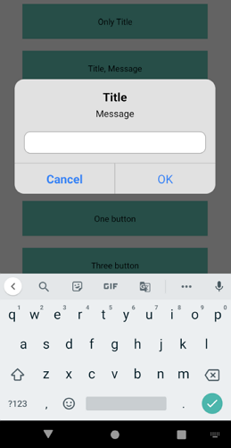
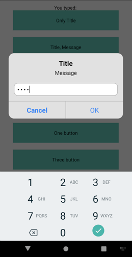
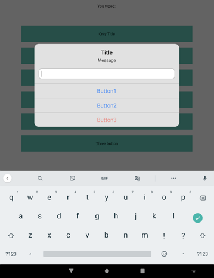

# React Native Prompt

[](https://badge.fury.io/js/%40powerdesigninc%2Freact-native-prompt)

This package helps you to use Prompt Dialog cross platform iOS(Alert.prompt) and Android(Dialog).

Use the same way as [`AlertIOS.prompt`](https://reactnative.dev/docs/alertios#prompt), simply just change Alert.prompt to prompt.

## Screenshots

<table>
  <tr>
    <td>
      Android Default Buttons
    </td>    
  </tr>
  <tr>
    <td>
            
    </td>   
  </tr>
  <tr>
    <td>
      Android Secure Text
    </td>    
  </tr>
  <tr>
    <td>
            
    </td>   
  </tr>
  <tr>
    <td>
      Android Three Buttons on Tablet
    </td>    
  </tr>
  <tr>
    <td>
            
    </td>   
  </tr>
<table>

## Installation

```bash
# with npm
npm install @powerdesigninc/react-native-prompt
# with yarn
yarn add @powerdesigninc/react-native-prompt
```

### React Native >= v0.60

you don't need to link anything.

### React Native < v0.60, Manual linking

```
react-native link @powerdesigninc/react-native-prompt
```

## Example

```tsx
import prompt from "@powerdesigninc/react-native-prompt";

const App = () => {
  return (
    <View>
      <TouchableOpacity
        onPress={() => {
          prompt('Title', null, (input)=>{console.log(input)}));
        }}>
        <Text>Show Prompt 1</Text>
      </TouchableOpacity>
      <TouchableOpacity
        onPress={() => {
          prompt(
            'Title',
            'Message',
            setInput,
            'secure-text',
            'default value',
            'numeric',
          );
        }}>
        <Text>Show Prompt 2</Text>
      </TouchableOpacity>
    </View>
  );
};
```

## Options

<table>
  <tr>
    <tr>
      Name
    </tr>
    <tr>
      Required
    </tr>
    <tr>
      Description
    </tr>
  </tr>
   <tr>
    <td>
      title      
    </td>   
    <td>
      yes      
    </td>   
    <td>
      The title of the prompt dialog      
    </td>   
  </tr>
  <tr>
    <td>
      message      
    </td>   
    <td>
      no      
    </td>   
    <td>
      The message of the prompt dialog      
    </td>   
  </tr>
  <tr>
    <td>
      callbackOrButtons      
    </td>   
    <td>
      no      
    </td>   
    <td>
      If value is function, then it show two buttons and bind the OK button with the function. <br><br> If value is array, then render the buttons with the value, the button options has three properties { text: string, style: string, onPress: Function }
    </td>   
  </tr>
  <tr>
    <td>
      type      
    </td>   
    <td>
      no      
    </td>   
    <td>
      One of "default", "plain-text","secure-text", "login-password".
      <br><br> NOTE: Android doesn't support login-password yet.
    </td>   
  </tr>
  <tr>
    <td>
      defaultValue      
    </td>   
    <td>
      no      
    </td>   
    <td>
      The default value of the prompt dialog
    </td>   
  </tr>
    <tr>
    <td>
      keyboardType      
    </td>   
    <td>
      no      
    </td>   
    <td>
      One of "default", "email-address", "numeric", "phone-pad", "ascii-capable", "numbers-and-punctuation", "url", "number-pad", "name-phone-pad", "decimal-pad", "twitter", "web-search"
      <br><br> NOTE: Android only supports "default", "numeric", "phone-pad", number-pad" for now.
    </td>   
  </tr>
<table>

## Run Example Project

```bash
cd example
yarn install

yarn ios
yarn android
```

## License

This project is licensed under the MIT License - see the [LICENSE.md](./LICENSE.md) file for details
